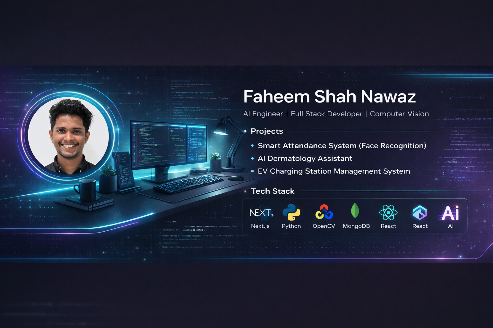

# Hi, I'm Faheem 👋

🚀 **MCA Student | Full Stack Developer**
💡 Passionate about building intelligent, real-world web applications

---

## 🧠 About Me

* 🎓 MCA Student with strong backend & system design interest
* ⚙️ Building scalable web apps & AI-powered systems
* 📚 Currently exploring **Machine Learning & System Architecture**
* 🧩 Love solving real-world problems through code

---

## 🛠️ Tech Stack

### 💻 Languages & Frameworks

### 🗄️ Databases

### ⚙️ Tools & Others

---

## 🚀 Projects

### 🧠 Smart Attendance System

AI-powered attendance using face recognition

**Features:**

* Face recognition attendance
* Role-based dashboards (Admin / Teacher / Student)
* Attendance analytics & reports
* Semester management

**Tech:** Next.js • Node.js • MongoDB • JWT

---

### ⚡ WattWay EV Charging System

EV charging station management platform

**Features:**

* Station & driver management
* Admin dashboard
* Real-time availability updates

**Tech:** PHP • MySQL • XAMPP

---

### 🧬 AI Dermatology Assistant

AI-based skin condition analysis system

**Features:**

* Image-based diagnosis support
* AI-generated dermatology insights
* Interactive UI for users

**Tech:** Python • ML • OpenCV • Gradio

---

## 📊 GitHub Stats

---

## 🎯 Current Focus

* 🔥 Full Stack Development
* 🤖 Machine Learning Integration
* ⚙️ Building production-ready systems

---

## 🌐 Connect With Me

* GitHub: https://github.com/arfaheemshahnawaz-web
* LinkedIn: https://www.linkedin.com/in/a-r-faheem-shah-nawaz

---

💬 *"Building real systems. Learning from failures. Growing every day."*
